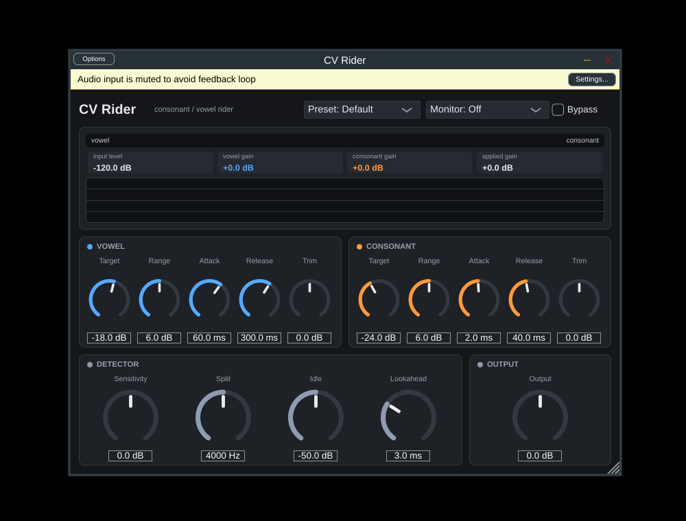

# CV Rider 詳細マニュアル

バージョン 0.2.1（2026-09-21）。対象: エンジニア・上級ユーザー。
噛み砕いた説明は [guide-for-everyone.md](guide-for-everyone.md)、用語と背景は [background.md](background.md)、Logic での導入は [logic-setup.md](logic-setup.md)、変更履歴は [CHANGELOG.md](CHANGELOG.md)。



## 1. 概要

CV Rider は、ボーカルトラックを**子音**（無声・摩擦・破裂音）と**母音**（有声音）にサンプル単位で分類し、
それぞれ独立したターゲット / レンジ / アタック・リリース / トリムで自動ゲインライド（フェーダーの自動書き込みに相当）を行うプラグインです。

| 項目 | 内容 |
|---|---|
| 形式 | AU（macOS）、VST3（macOS / Windows / Linux）、Standalone |
| 入出力 | モノ or ステレオ（入出力同数）。ステレオは L+R のモノミックスで検出し、両チャンネルに同じゲインを適用 |
| サンプルレート | 任意（44.1 / 48 / 96 kHz でテスト済み。時間系パラメータはレート非依存） |
| レイテンシ | Lookahead と同じ（既定 3 ms = 48 kHz で 144 サンプル）。ホストに報告済み |
| 内部処理 | 32 bit float、サンプル単位 |
| CPU 負荷 | 1 サンプルあたり数個の対数 / 指数演算。ボーカル 1 トラックあたり無視できる量 |

## 2. 信号処理

```
in ──┬─► ルックアヘッド遅延 ───────────────────────────────► × gain ─► out
     │
     └─► 検出器（モノミックス → DC ブロッカー 20 Hz）
           ├─ HP バンド (Split, 2 次バターワース) ─► hf エネルギー（6 ms）─┐
           ├─ 全帯域 ──────────────────────────► 全エネルギー（6 ms）──┴─► 帯域比 [dB]
           ├─ HP バンドの速い / 遅いエンベロープ（0.5 ms / 30 ms）─► トランジェント [dB]
           │      → 子音確率 c = max(帯域比スコア, トランジェントスコア) を 1 ms / 20 ms で平滑化
           ├─ 母音 RMS（40 ms、子音中は更新停止）─► 母音ライダー gv = clamp(TargetV − Lv, ±RangeV)
           └─ 子音 RMS（ 5 ms）──────────────────► 子音ライダー gc = clamp(TargetC − Lc, ±RangeC)

gain[dB] = c·(gc + TrimC) + (1 − c)·(gv + TrimV) + Output
```

### 2.1 子音判定

- **帯域比** = 10·log10(hf / total)。母音は −20〜−30 dB、歯擦音は 0 dB 付近。
- スコア = smoothstep(thr − 4, thr + 4, 帯域比)。**thr = −9 dB − Sensitivity**。
- **トランジェント** = HP バンドの速いエンベロープ / 遅いエンベロープ [dB]。smoothstep(5, 11, transDb) × smoothstep(thr − 12, thr − 4, 帯域比) で、帯域比が「子音寄り」のときだけ有効。破裂音（t / k / p）の頭を拾うため。
- **Idle**: 子音用 RMS と母音用 RMS が両方 Idle Threshold 未満なら c = 0（ノイズフロアを子音と数えない）、両ライダーは 0 dB へ戻る。
- c の平滑化: 立ち上がり 1 ms、立ち下がり 20 ms。

### 2.2 ライダー

- 各ライダーの目標ゲインは `clamp(Target − Level, −Range, +Range)`。
- **Attack** はゲインが下がる方向、**Release** は上がる方向の 1 次時定数。
- **母音ライダーのホールド**: 子音中（c ≈ 1）は母音ゲインの更新レートが (1 − c) 倍になり、実質停止。母音用 RMS 検出器も同様に停止するので、大きな子音が母音レベルの測定を汚さない。
- **子音ライダー**は常時追従（子音の頭で即座に正しい値にいる必要があるため）。

### 2.3 スムージング

- Trim / Output: 10 ms の 1 次スムーザー。
- 最終リニアゲイン: 1 ms のスムーザー。Bypass / Monitor / Range の切替でもクリックしない。
- `prepare()` / `reset()` 直後の最初のサンプルで全スムーザーが現在値にスナップする（起動時のランプなし）。

### 2.4 ルックアヘッド

音声側だけを最大 10 ms 遅らせ、検出器は遅延前の信号を見る。Bypass 中も遅延は維持（レイテンシ一定）。

## 3. パラメータ一覧

| ID | 表示名 | 範囲 | 既定 | 説明 |
|---|---|---|---|---|
| `vowelTarget` | Vowel Target | −40〜0 dB | −18 | 母音をこの RMS レベルへ |
| `vowelRange` | Vowel Range | 0〜12 dB | 6 | 母音ライダーの最大 ± ゲイン。0 で無効 |
| `vowelAttack` | Vowel Attack | 1〜500 ms | 60 | 母音ゲインが下がる速さ |
| `vowelRelease` | Vowel Release | 10〜2000 ms | 300 | 母音ゲインが上がる速さ |
| `vowelTrim` | Vowel Trim | −12〜+12 dB | 0 | 母音だけに掛かる固定ゲイン |
| `consTarget` | Consonant Target | −40〜0 dB | −24 | 子音をこの RMS レベルへ |
| `consRange` | Consonant Range | 0〜12 dB | 6 | 子音ライダーの最大 ± ゲイン。0 で無効 |
| `consAttack` | Consonant Attack | 0.1〜50 ms | 2 | 子音ゲインが下がる速さ |
| `consRelease` | Consonant Release | 5〜500 ms | 40 | 子音ゲインが上がる速さ |
| `consTrim` | Consonant Trim | −12〜+12 dB | 0 | 子音だけに掛かる固定ゲイン（ディエッサー的） |
| `sensitivity` | Sensitivity | −12〜+12 dB | 0 | 判定しきい値のシフト。+ で子音判定が増える |
| `splitFreq` | Split Freq | 2000〜8000 Hz | 4000 | 子音バンドの HP カットオフ |
| `idleThreshold` | Idle Threshold | −80〜−20 dB | −50 | これ未満は無処理（両ライダー 0 dB、c = 0） |
| `lookahead` | Lookahead | 0〜10 ms | 3 | 音声の遅延 = レイテンシ |
| `output` | Output | −24〜+24 dB | 0 | 出力トリム |
| `monitor` | Monitor | Off / Consonants / Vowels | Off | 判定結果のソロ試聴（出力 = 入力 × c、または × (1 − c)） |
| `bypass` | Bypass | Off / On | Off | ゲイン 1.0（遅延は維持） |

すべてのパラメータはホストのオートメーション対象。Monitor は試聴専用で、書き出し時は Off にすること。

## 4. プリセット

`plugin/cpp/Presets.h` に定義（Web 版は `index.html` の `PRESETS`）。JUCE 版では DAW の「プログラム」としても見える。

| 名前 | 主な設定（既定からの差分） | 用途 |
|---|---|---|
| Default | — | 出発点 |
| Lead Vocal | V: Range 8 / Att 40 / Rel 250、C: Range 8 / Att 1.5 / Trim −1 | ポップス / ロックのメイン |
| Gentle | V: Range 4 / Att 100 / Rel 500、C: Range 3 / Att 3 / Rel 60 | 軽い整え |
| De-ess Only | V: Range 0、C: Target −26 / Range 10 / Att 1 / Rel 30 / Trim −2、Sens +2 | 歯擦音のみ |
| Clarity | V: Range 3、C: Target −18 / Range 8 / Trim +2 | 子音の明瞭度 |
| Breathy | Sens −4、Split 5000、V: Target −20 / Att 80 / Rel 400、C: Range 4 | ウィスパー |
| Narration | V: Target −20 / Range 10 / Att 30 / Rel 200、C: Target −26 / Range 8 | 朗読 |

## 5. 推奨ワークフロー

1. **挿入位置**: ピッチ補正の後、EQ / コンプの前。ライドでレベルがそろうと後段のコンプが安定する。
2. **判定の確認**: Monitor = Consonants で再生し、Sensitivity / Split を「子音だけが聞こえる」位置に。ブレスが混ざるなら Sensitivity を下げる。確認後 Off に戻す。
3. **目標**: 母音 Target をトラックの狙い（−18 dB 前後）、子音 Target をその 4〜8 dB 下。
4. **レンジ**: 小さめ（4〜6 dB）から始め、必要に応じて広げる。12 dB は「かなり不揃いなテイク」向け。
5. **トリム**: 歯擦音が刺さる → Consonant Trim −2〜−4。子音が埋もれる → +2。
6. **ルックアヘッド**: 子音の頭が欠けるなら 5〜8 ms。ライブモニター用途では 0。
7. **バウンス前**: Monitor が Off であること、Bypass が Off であることを確認。

## 6. 導入

### macOS（テスト運用 → 本番）

**ビルド済みを使う（推奨）** — 詳細は [logic-setup.md](logic-setup.md)

ターミナルに 1 行貼るだけ（`curl` 経由のダウンロードには quarantine 属性が付かないので Gatekeeper のダイアログが出ない）:

```bash
cd ~/Downloads && curl -fL -o cvrider-macos.zip https://github.com/yossy-netizen/atoz-journal/releases/download/cvrider-latest/cvrider-macos.zip && rm -rf cvrider-macos && ditto -x -k cvrider-macos.zip . && cd cvrider-macos && chmod +x install-mac.sh && ./install-mac.sh .
```

Finder 派は zip をダブルクリックで展開 → `Install CV Rider.command` をダブルクリック（初回のみ Gatekeeper を通す）。
どちらの場合も最後に DAW を再起動する（Logic: 設定 → プラグインマネージャー → リセット & 再スキャン）。
zip は rolling pre-release `cvrider-latest` に CI が `push` のたびに再アップロードする。

zip は `ditto` で作成（実行ビット・シンボリックリンク・署名を保持）。`install-mac.sh` は AU / VST3 / Standalone をコピーし、実行ビットを復元、隔離属性（`com.apple.quarantine`）を除去、アドホック署名、`auval -v aufx Cvrd AtoZ` を実行する。Actions の Artifacts にも同じ zip が `cvrider-macos` として残る。

**Mac 上でビルド**
```bash
xcode-select --install && brew install cmake     # 初回
cd plugin/juce && ./build-mac.sh                 # ビルド → 署名 → インストール → auval
```

### Windows / Linux

```bash
cd plugin/juce
cmake -B build -DCMAKE_BUILD_TYPE=Release
cmake --build build --config Release
```
生成物は `build/CVRider_artefacts/Release/VST3/CV Rider.vst3`。Linux は `libasound2-dev libxrandr-dev libxinerama-dev libxcursor-dev libxext-dev libfreetype-dev libfontconfig-dev` が必要。

### 識別子

| 項目 | 値 |
|---|---|
| Manufacturer / Plugin code | `AtoZ` / `Cvrd` |
| AU type | `aufx`（Effect） |
| Bundle ID | `com.atoz-studio.cvrider` |

## 7. トラブルシューティング

| 症状 | 確認・対処 |
|---|---|
| Logic に出てこない | `auval -v aufx Cvrd AtoZ` を実行して結果を確認。失敗するならインストール先と署名を確認（`codesign -dv "~/Library/Audio/Plug-Ins/Components/CV Rider.component"`） |
| 「開発元を確認できないため開けません」 | `xattr -dr com.apple.quarantine <バンドル>` → `codesign --force --deep --sign - <バンドル>`（`install-mac.sh` が行う内容） |
| ブレスで持ち上がる | Sensitivity を下げる（−2〜−6）。Split を 5 kHz に上げる。Idle を上げてブレスを無音扱いにする |
| 歯擦音が残る | Consonant Trim を下げる。Consonant Attack を短く（1 ms）。Sensitivity を上げる |
| 子音の頭が欠ける | Lookahead を増やす。Consonant Attack が長すぎないか（2 ms 以下推奨） |
| ポンピング（ふわふわ） | Vowel Range を減らす、Attack / Release を長く。Idle を上げてフレーズ間の持ち上げを止める |
| バウンスとリアルタイムで結果が違う | 0.2.0 で起動時ランプを修正済み。ホストの PDC が有効か確認。Monitor が Off か確認 |
| ステレオで定位が動く | 両チャンネルに同一ゲインを適用しているので動かない設計。動く場合は入力バス設定（モノ→ステレオ）を確認 |

## 8. 検証と品質

- `plugin/cpp/test/test_cvrider.cpp`: 分類、各ライダーの到達レベル、トリム、Idle、ルックアヘッド、モニター、ステレオ一致、DC 耐性、パラメータ変更のクリック、起動時ランプ（30 項目 × 3 レート）。
- `plugin/cpp/test/test_phonemes.cpp`: フォルマント合成母音（/a/ /i/ /u/ /e/、男声 / 女声）、息混じり母音、/s/ /sh/ /f/ /h/、破裂音、「sa-shi-su」列（20 項目 × 3 レート）。
- Web: `run.mjs`（OfflineAudioContext での挙動）、`ui.mjs`（再生・メーター・プリセット・書き出し・96 kHz）。
- JUCE: pluginval strictness 10（AU / VST3）、`auval`。CI（`.github/workflows/plugin-tests.yml`）で Linux と macOS の両方。

## 9. 既知の制限と今後

- 判定はエネルギー比ベース。有声摩擦音（z / v / j）は中間値になる。ピッチ有無（自己相関）による有声判定は今後の候補。
- 子音の種類（歯擦 / 破裂 / 気音）ごとのターゲット分けは未実装。
- Developer ID 署名 / 公証は未対応（配布時は `install-mac.sh` の手順が必要）。
- サイドチェイン（オケ）に追従する Music Sensitivity は未実装。

## 10. ファイル構成

```
plugin/
├── cpp/CVRider.h          DSP コア（正本）
├── cpp/Presets.h          プリセット
├── cpp/test/              挙動テスト（test_util.h 共通）
├── juce/                  JUCE プロジェクト、build-mac.sh、install-mac.sh
├── web/                   AudioWorklet 版、デモページ、Playwright テスト
└── docs/                  本マニュアル、guide-for-everyone、background、CHANGELOG
```
